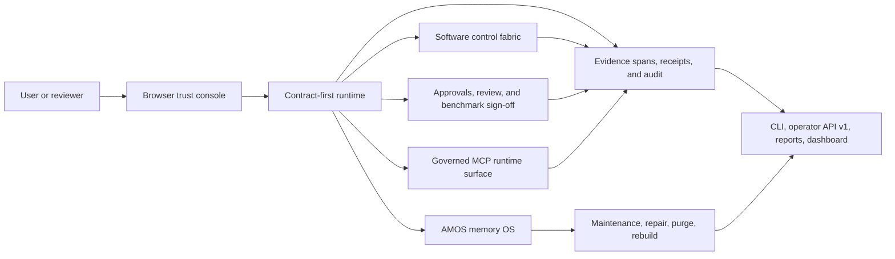

# Contract-Evidence OS

> A **trusted AI runtime** for contract-and-evidence workflows: an **auditable AI agent**, **agent operating system**, **long-term memory agent**, **desktop automation agent**, and **self-hosted AI agent runtime** built for small teams and serious local operation.

Contract-Evidence OS is for people who want more than a chat loop with tool calls.

It is designed for work that needs to be explainable after the fact, recoverable after interruption, reviewable by another person, and operable through a browser console, CLI, and API without losing the evidence trail.

If you want an agent that can run for a long time, remember state, control real software, expose token usage, support multiple users, and still leave behind contracts, evidence, audit logs, and replayable receipts, this repository is that system.

## Why This Project Exists

Most agent stacks are good at demos and weak at trust.

They can often answer a prompt, maybe call a tool, maybe store a little context, but they usually break down when you need all of these at the same time:

- explicit expectations instead of prompt drift
- evidence and receipts instead of opaque claims
- long-horizon memory instead of shallow chat history
- approvals and review instead of silent risk
- repair, replay, and recovery instead of “just rerun it”
- governed automation instead of unsafe desktop control
- team visibility instead of single-user hidden state

Contract-Evidence OS exists to make those properties first-class.

## What It Is

At its core, Contract-Evidence OS is a **trusted runtime for contract-and-evidence work**.

It combines four big layers:

1. **Trusted Runtime Core**
   Contract-first execution, structured schemas, evidence lineage, audit logging, playbooks, human review, and benchmark/repro flows.
2. **AMOS Memory OS**
   Long-term memory with episodic, semantic, procedural, temporal, and source-grounded matrix-pointer memory, plus purge, rebuild, repair, and maintenance.
3. **Governed Software Control Fabric**
   Desktop and app automation through manifests, capability records, risk classes, approvals, action receipts, replay diagnostics, recovery hints, and failure clusters.
4. **Browser-First Operator Console**
   A local web console for setup, login, tasks, memory, software control, maintenance, usage, audit, benchmarks, collaboration, settings, and doctor diagnostics.

## Why It Is Different

This is not just another agent framework.

- **Contract-first runtime**: work is compiled into explicit expectations, constraints, and approval boundaries before execution.
- **Evidence-bound execution**: claims, outputs, approvals, and software actions stay linked to traceable source records and evidence spans.
- **Audit-first design**: the system is built around append-only runtime activity, not just final answers.
- **AMOS memory OS**: memory includes kernel receipts, timelines, project state, purge, rebuild, contradiction repair, and maintenance operations instead of a loose summary store.
- **Trusted human review loop**: approval, evidence review, delivery review, and benchmark sign-off all fit inside the same governed control plane.
- **Governed software automation**: the system can control software without turning into an unconstrained GUI bot.
- **Small-team ready control plane**: browser sessions, local users, roles, OIDC settings, invitations, token usage, and collaboration surfaces are already part of the product shape.

## Who It Is For

Contract-Evidence OS is strongest for:

- technical leads who want a trustworthy agent control plane for a small team
- builders who want a self-hosted AI agent runtime instead of a hosted black box
- operators who need evidence, approvals, replay, and auditability
- developers who want an open-source long-term memory agent with real operational surfaces
- teams exploring governed desktop automation, MCP-connected tools, and browser-first operator workflows

## What You Can Do With It

Typical use cases include:

- run long-lived agent tasks with contracts, checkpoints, and replay
- maintain project state and memory across sessions through AMOS
- operate software through governed harnesses and receipts
- inspect why a task is blocked, who needs to review it, and where the evidence came from
- watch token usage and estimated cost by task and provider
- review maintenance incidents, recovery recommendations, and repair history
- manage local accounts, sessions, invitations, and OIDC configuration from the console
- expose and consume governed MCP surfaces without bypassing the trust model

## Human-Friendly Trust Console

The default human surface is the browser console served by `ceos-server`.

It gives you:

- `/setup` for first-run bootstrap
- `/login` for local accounts and shared-user browser sessions
- `/dashboard` for health, queues, recent tasks, approvals, usage, audit, and benchmark posture
- `/tasks/:taskId` for the task cockpit, timeline, evidence trace, playbook, approvals, and collaboration state
- `/memory` for AMOS overview, timelines, project-state, and maintenance posture
- `/software` for harnesses, manifests, macros, failures, and recovery hints
- `/maintenance` for daemon state, incidents, recommendations, and rollout posture
- `/usage` for token and cost monitoring
- `/audit`, `/benchmarks`, `/playbooks`, `/collaboration`, and `/mcp` for deeper trusted-runtime views
- `/settings` for provider, runtime, auth, and OIDC configuration
- `/doctor` for startup and readiness diagnostics

If you want something closer to an operator workstation than a pile of scripts, this is the place to start.

## Core Advantages

If someone asks what this repository is good at, the short answer is:

- an **auditable AI agent** you can inspect after the fact
- a **long-term memory agent** with real maintenance, repair, and project-state surfaces
- a **desktop automation agent** with approvals, manifests, and replay
- a **self-hosted AI agent runtime** with browser, CLI, and HTTP operator surfaces
- an **evidence-based AI agent** that ties action back to traceable source state
- a **trusted AI runtime** for teams that need governance, review, and reproducibility

## See The System In One View



In one sentence: Contract-Evidence OS takes work in, turns it into an explicit contract, executes it with evidence and receipts, stores and repairs memory through AMOS, keeps software control inside governed boundaries, and exposes the result through a trusted runtime console.

## Quick Start

### Recommended install path

The easiest local-first install is:

```bash
git clone https://github.com/wuls968/contract-evidence-os.git contract-evidence-os
cd contract-evidence-os
./scripts/install.sh --init-config
```

That installer will:

- create a local `.venv`
- install the project into it
- expose `ceos`, `ceos-server`, `ceos-worker`, `ceos-dispatcher`, and `ceos-maintenance`
- build the React/Vite dashboard bundle when `npm` is available
- interactively write `runtime/config.local.json` and `runtime/.env.local`
- ask for `CEOS_OPERATOR_TOKEN`, provider kind, base URL, default model, and `CEOS_API_KEY`
- optionally verify provider connectivity during install

If you later want to remove the local command shims:

```bash
./scripts/uninstall.sh
```

If you also want to remove the local virtual environment:

```bash
./scripts/uninstall.sh --remove-venv
```

### First successful launch

```bash
source runtime/.env.local
ceos --config runtime/config.local.json doctor
ceos --config runtime/config.local.json system-report
ceos --config runtime/config.local.json service-health
ceos-server --config runtime/config.local.json
```

Then open:

- [http://127.0.0.1:8080/](http://127.0.0.1:8080/)

Expected first-run behavior:

- if no admin exists, `/` redirects to `/setup`
- after bootstrap, `/` redirects to `/login`
- after sign-in, the console opens on `/dashboard`

### What gets configured

You need two separate kinds of credentials:

- `CEOS_OPERATOR_TOKEN`
  This protects the local or remote operator service started by `ceos-server`.
- `CEOS_API_KEY`
  This is the provider credential used when you want live model access instead of deterministic fallback behavior.

These are different on purpose:

- the operator token secures your control plane
- the API key talks to your model provider

## Documentation

If you want the shortest path:

- [Getting Started](docs/manual/getting-started.md)

If you want the complete operational manual:

- [Complete User Guide](docs/manual/user-guide.md)

If you want protocol and interface details:

- [Operator API v1](docs/api/operator-v1.md)
- [Release 0.9.0](docs/releases/0.9.0.md)
- [Migration guide](docs/releases/migration-0.9.0.md)

## Trusted Runtime Architecture

Contract-Evidence OS is organized around four cooperating cores.

### 1. Trusted Runtime Core

The trusted runtime is responsible for:

- contract compilation
- evidence-bound execution
- schema-aware payloads
- approvals and review flow
- audit logging and replay
- benchmark and reproducibility surfaces
- queueing, admission control, and execution continuity

### 2. AMOS Memory OS

AMOS is the memory layer.

It includes:

- raw episodic ledger
- working memory capture
- temporal semantic memory
- procedural memory
- source-grounded matrix pointers
- evidence packs and kernel views
- selective purge, hard purge, rebuild, contradiction repair, and project-state reconstruction
- maintenance schedules, workers, incidents, rollout analytics, and repair fabric operations

### 3. Software Control Fabric

The software control fabric is the governed automation layer.

It includes:

- CLI-Anything harness discovery and registration
- app capability records and harness manifests
- software action receipts and replay records
- replay diagnostics, recovery hints, and failure clusters
- approval-gated high-risk actions
- macros for multi-step software procedures

### 4. Collaboration and Control Plane

The control plane is where people and runtime meet.

It includes:

- local accounts and browser sessions
- roles and scope-bound access
- invitation and bootstrap flows
- OIDC-ready provider configuration
- dashboard, settings, doctor, usage, maintenance, audit, and task cockpit surfaces

## How It Works

At a high level, the system follows this loop:

1. compile work into a contract
2. execute with evidence spans, receipts, and audit events
3. update AMOS memory and project state
4. expose operator-facing reports, usage, maintenance state, and review posture
5. allow replay, repair, purge, rebuild, benchmark, and policy-governed evolution

That is why this repository behaves more like an **agent operating system** or **trusted agent runtime** than a one-shot prompt wrapper.

## Public Interfaces

### CLI

The main operator entrypoints are:

- `ceos`
- `ceos-server`
- `ceos-worker`
- `ceos-dispatcher`
- `ceos-maintenance`

The CLI covers:

- task creation, replay, audit, evidence, and approvals
- memory kernel, evidence pack, timeline, project state, policy, and maintenance surfaces
- software harness manifests, action receipts, and software-control reporting
- system, metrics, maintenance, service-health, and doctor diagnostics

### Operator API v1

The versioned HTTP contract lives in [docs/api/operator-v1.md](docs/api/operator-v1.md).

It covers:

- runtime and task inspection
- AMOS memory kernel, timeline, project-state, policy, purge, rebuild, and maintenance routes
- software-control manifests, receipts, reports, failure clusters, and recovery hints
- service reports, metrics history, startup validation, and browser-console-adjacent runtime surfaces

## Use Cases

This repository is a strong fit if you want any of these:

- “an open-source AI agent with long-term memory”
- “an auditable AI agent with replay and evidence”
- “a self-hosted desktop automation agent”
- “an AI agent runtime for reliable long-running tasks”
- “an AI agent with governed software control”
- “an AI agent with memory repair, maintenance, and recovery”
- “a trusted runtime for evidence-based agent work”
- “a small-team agent console with audit, approvals, and usage monitoring”

## Repository Map

- [src/contract_evidence_os/runtime](src/contract_evidence_os/runtime)
  runtime execution, routing, provider, auth, coordination, reliability, and shared-state logic
- [src/contract_evidence_os/memory](src/contract_evidence_os/memory)
  AMOS kernel, matrix facade, repair, purge, rebuild, and maintenance operations
- [src/contract_evidence_os/tools/anything_cli](src/contract_evidence_os/tools/anything_cli)
  governed software control fabric and CLI-Anything integration
- [src/contract_evidence_os/trusted_runtime](src/contract_evidence_os/trusted_runtime)
  trusted runtime read models for schema, audit, playbooks, benchmarks, collaboration, and MCP
- [src/contract_evidence_os/api](src/contract_evidence_os/api)
  CLI, operator API, ASGI server, and role entrypoints
- [frontend](frontend)
  browser trust console
- [docs/adr](docs/adr)
  architectural decision trail
- [docs/examples](docs/examples)
  worked examples for runtime, AMOS, repair, control plane, and software control flows

## Packaging, Docker, and Quality

### Build artifacts

```bash
python3 -m build --sdist --wheel
```

### Run tests

```bash
python3 -m pytest -q tests
```

### Docker

```bash
docker build -t contract-evidence-os .
docker run --rm -p 8080:8080 contract-evidence-os
```

The container defaults to `ceos-server --host 0.0.0.0`. If `CEOS_OPERATOR_TOKEN` is not set, the entrypoint generates an ephemeral token and prints it to container logs.

## Current Boundaries

- AMOS is source-grounded and pointer-based; it does not hide private user memory inside opaque model weights.
- The software control fabric is governed; it is not an unconstrained GUI bot.
- The system is small-team and self-hosted first; it is not yet a full enterprise multi-tenant control plane.
- MCP is integrated as a governed runtime surface, not as an unbounded bypass around contracts, approvals, or audit.

## Learn More

- [Getting Started](docs/manual/getting-started.md)
- [Complete User Guide](docs/manual/user-guide.md)
- [Operator API v1](docs/api/operator-v1.md)
- [Future extension path](docs/architecture/future-extension-path.md)
- [Release 0.9.0](docs/releases/0.9.0.md)
- [Migration guide](docs/releases/migration-0.9.0.md)
