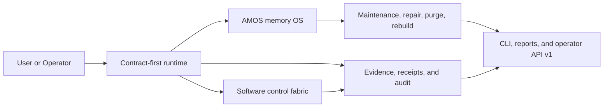

# Contract-Evidence OS

> An **auditable AI agent**, **agent operating system**, and **self-hosted AI agent runtime** for long-running work, long-term memory, and governed desktop automation.

Contract-Evidence OS is built for people who want more than a prompt loop.

It is designed for tasks that need to run for a long time, remember what happened, control real software, recover from interruptions, and still leave behind a clean audit trail. If you want a **long-term memory agent**, an **evidence-based AI agent**, or a **desktop automation agent** you can actually inspect and trust, this repository is what that looks like in code.

## Why This Project Exists

Most agent stacks are good at demos and weak at operations.

They can respond once, maybe call tools, maybe store a few notes, but they usually break down when you need all of this at the same time:

- repeatable execution instead of prompt drift
- evidence and receipts instead of opaque claims
- long-horizon memory instead of shallow chat history
- repair, replay, and recovery instead of “just rerun it”
- software control with governance instead of unsafe automation

Contract-Evidence OS exists to make those properties first-class.

## Why It Is Different

This project is not just another agent framework.

- **Contract-first runtime**: work is compiled into a contract before execution, so the system has explicit expectations, constraints, and approval boundaries.
- **Evidence-bound execution**: important outputs, decisions, and software actions stay linked to evidence, receipts, and audit lineage.
- **AMOS memory OS**: memory is not a loose vector store. It includes episodic memory, semantic memory, procedural memory, source-grounded matrix pointers, purge, rebuild, repair, and maintenance.
- **Governed software control fabric**: desktop and app automation run through manifests, risk classes, approvals, action receipts, replay diagnostics, and failure clustering.
- **Operator-grade maintenance**: the system can inspect itself, run maintenance cycles, surface incidents, and recover from drift without turning into an uncontrolled scheduler.

## What You Can Do With It

Contract-Evidence OS is built for workflows like:

- running long-lived tasks that need auditability and replay
- keeping project state and memory across sessions
- operating software through governed CLI-Anything harnesses
- building a self-hosted desktop automation agent with better control boundaries
- creating an AI agent with long-term memory, evidence, approvals, and recovery
- managing maintenance, incidents, and repair from both CLI and remote operator APIs

## Core Advantages

If someone asks what this project is good at, the short answer is:

- an **auditable AI agent** you can inspect after the fact
- a **long-term memory agent** that does more than store summaries
- a **desktop automation agent** with approvals, manifests, and replay
- a **self-hosted AI agent runtime** with CLI and HTTP operator surfaces
- an **evidence-based AI agent** that ties action back to traceable state
- a **replayable AI automation** system for long-running work

## See The System In One View



In one sentence: Contract-Evidence OS takes work in, turns it into an explicit contract, executes it with evidence and receipts, stores and repairs memory through AMOS, and keeps software control inside governed, replayable boundaries.

## Quick Start

### Recommended install path

The easiest local-first install is:

```bash
git clone https://github.com/wuls968/contract-evidence-os.git contract-evidence-os
cd contract-evidence-os
./scripts/install.sh
```

That installer will:

- create a local `.venv`
- install the project into it
- expose `ceos`, `ceos-server`, `ceos-worker`, `ceos-dispatcher`, and `ceos-maintenance`
- keep everything user-local instead of trying to write system-wide files

If you want the installer to also generate a ready-to-edit local runtime profile:

```bash
./scripts/install.sh --init-config
```

That creates:

- `runtime/config.local.json`
- `runtime/.env.local`

### First commands to run

After install:

```bash
ceos system-report
ceos api-contract
```

If your shell cannot find `ceos`, the installer will tell you exactly which user-level bin directory to add to your `PATH`.

### Local config bootstrap

If you used `--init-config`, a simple local-first startup path is:

```bash
source runtime/.env.local
ceos --config runtime/config.local.json system-report
ceos-server --config runtime/config.local.json
```

The generated `config.local.json` keeps structured runtime settings such as storage root, host, port, observability, maintenance, and software-control defaults. The generated `.env.local` keeps local environment values such as `CEOS_OPERATOR_TOKEN`.

### Development install

If you want tests and build tooling too:

```bash
./scripts/install.sh --with-dev
python3 -m pytest -q tests
```

### Uninstall

If you want to remove the user-level command shims:

```bash
./scripts/uninstall.sh
```

If you also want to remove the local virtual environment:

```bash
./scripts/uninstall.sh --remove-venv
```

## Architecture At A Glance

Contract-Evidence OS is organized around three cores.

### 1. Runtime OS

The runtime OS is responsible for:

- contract compilation
- evidence-bound execution
- shadow verification
- queueing and admission control
- worker coordination, leases, and recovery
- provider routing, fairness, reservations, and quotas
- remote operator control with scoped auth and replay protection

### 2. AMOS Memory OS

AMOS is the memory layer.

It includes:

- raw episodic ledger
- working memory capture
- temporal semantic memory
- procedural memory
- source-grounded matrix pointers
- evidence packs and kernel views
- selective purge, hard purge, rebuild, contradiction repair, and project-state reconstruction
- maintenance schedules, maintenance workers, incidents, rollout analytics, and repair fabric operations

### 3. Software Control Fabric

The software control fabric is the governed automation layer.

It includes:

- CLI-Anything harness discovery and registration
- app capability records and harness manifests
- software action receipts and replay records
- replay diagnostics, recovery hints, and failure clusters
- approval-gated high-risk actions
- macros for multi-step software procedures

## How It Works

At a high level, the system follows this loop:

1. compile work into a contract
2. execute with evidence and receipts
3. update AMOS memory and project state
4. expose operator-facing reports, maintenance state, and software receipts
5. allow replay, repair, purge, rebuild, and policy-governed evolution

That is why this repository behaves more like an **agent operating system** than a one-shot agent wrapper.

## Public Interfaces

### CLI

The main operator entrypoints are:

- `ceos`
- `ceos-server`
- `ceos-worker`
- `ceos-dispatcher`
- `ceos-maintenance`

The CLI covers:

- task creation, replay, audit, evidence, and approvals
- memory kernel, evidence pack, timeline, project state, policy, and maintenance surfaces
- software harness manifests, action receipts, and software-control reporting
- system, metrics, maintenance, and service-health reports

### Operator API v1

The versioned HTTP contract lives in [operator-v1.md](/Users/a0000/contract-evidence-os/docs/api/operator-v1.md).

It covers:

- runtime and task inspection
- AMOS memory kernel, timeline, project-state, policy, purge, rebuild, and maintenance routes
- software-control manifests, receipts, reports, failure clusters, and recovery hints
- service reports, metrics history, and startup validation

## Use Cases

This repository is a strong fit if you want any of these:

- “an open-source AI agent with long-term memory”
- “an auditable AI agent with replay and evidence”
- “a self-hosted desktop automation agent”
- “an AI agent runtime for reliable long-running tasks”
- “an AI agent with governed software control”
- “an AI agent with memory repair, maintenance, and recovery”

## FAQ

### Is this just an agent framework?

No. It behaves more like an **agent operating system**. It has contracts, evidence, audit, memory maintenance, software control, operator APIs, and long-running maintenance logic.

### Does it support long-term memory?

Yes. AMOS is explicitly built for long-horizon state, including episodic, semantic, procedural, and source-grounded matrix-pointer memory.

### Can it control desktop software?

Yes, through a governed **software control fabric** built around CLI-Anything harnesses, manifests, approvals, receipts, replay diagnostics, and recovery hints.

### Is it self-hosted?

Yes. This project is meant to run as a **self-hosted AI agent runtime** with local-first operation and optional remote operator governance.

### Is it auditable and replayable?

Yes. That is one of the main reasons it exists. Contracts, evidence, receipts, replay, and audit lineage are all first-class parts of the design.

### How is it different from plain RAG or workflow tools?

RAG alone does not give you a full long-running agent runtime, and workflow tools alone do not give you governed memory, evidence, or software control. Contract-Evidence OS combines runtime, memory, audit, and automation into one system.

## Repository Map

- [src/contract_evidence_os/runtime](/Users/a0000/contract-evidence-os/src/contract_evidence_os/runtime)
  runtime execution, routing, provider, auth, coordination, reliability, and shared-state logic
- [src/contract_evidence_os/memory](/Users/a0000/contract-evidence-os/src/contract_evidence_os/memory)
  AMOS kernel, matrix facade, repair, purge, rebuild, and maintenance operations
- [src/contract_evidence_os/tools/anything_cli](/Users/a0000/contract-evidence-os/src/contract_evidence_os/tools/anything_cli)
  governed software control fabric and CLI-Anything integration
- [src/contract_evidence_os/api](/Users/a0000/contract-evidence-os/src/contract_evidence_os/api)
  CLI, operator API, remote server, and role entrypoints
- [docs/adr](/Users/a0000/contract-evidence-os/docs/adr)
  architectural decision trail
- [docs/examples](/Users/a0000/contract-evidence-os/docs/examples)
  worked examples for runtime, AMOS, repair, control plane, and software control flows

## Packaging, Docker, and Quality

### Build artifacts

```bash
python3 -m build --sdist --wheel
```

### Run tests

```bash
python3 -m pytest -q tests
```

### Docker

```bash
docker build -t contract-evidence-os .
docker run --rm -p 8080:8080 contract-evidence-os
```

The container defaults to `ceos-server --host 0.0.0.0`. If `CEOS_OPERATOR_TOKEN` is not set, the entrypoint generates an ephemeral token and prints it to container logs.

## Current Boundaries

- AMOS is source-grounded and pointer-based; it does not hide private user memory inside opaque model weights.
- The software control fabric is governed; it is not an unconstrained GUI bot.
- Maintenance is resident and auditable, but still specialized to memory/runtime operations instead of becoming a second generic scheduler.

## Learn More

- [Operator API v1](/Users/a0000/contract-evidence-os/docs/api/operator-v1.md)
- [Future extension path](/Users/a0000/contract-evidence-os/docs/architecture/future-extension-path.md)
- [Release 0.9.0](/Users/a0000/contract-evidence-os/docs/releases/0.9.0.md)
- [Migration guide](/Users/a0000/contract-evidence-os/docs/releases/migration-0.9.0.md)
